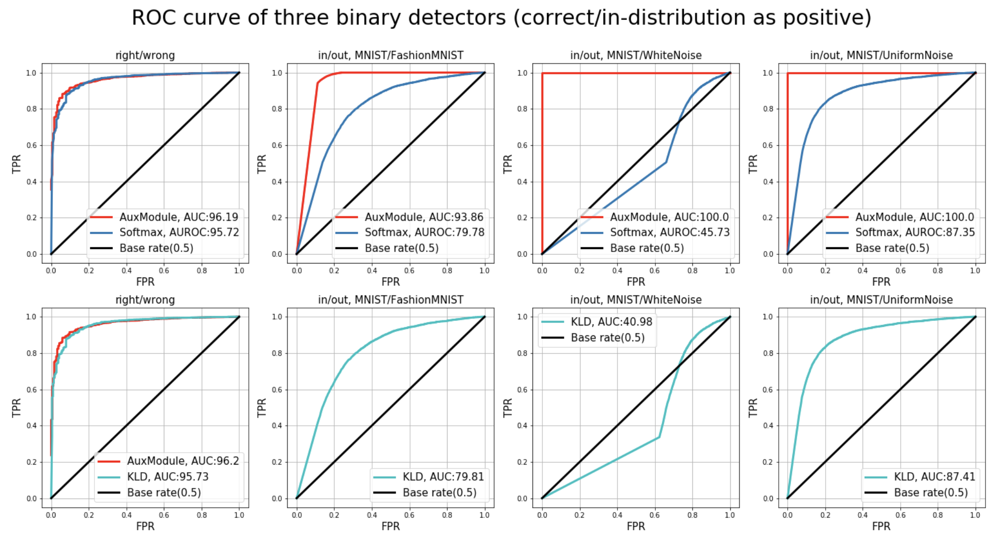
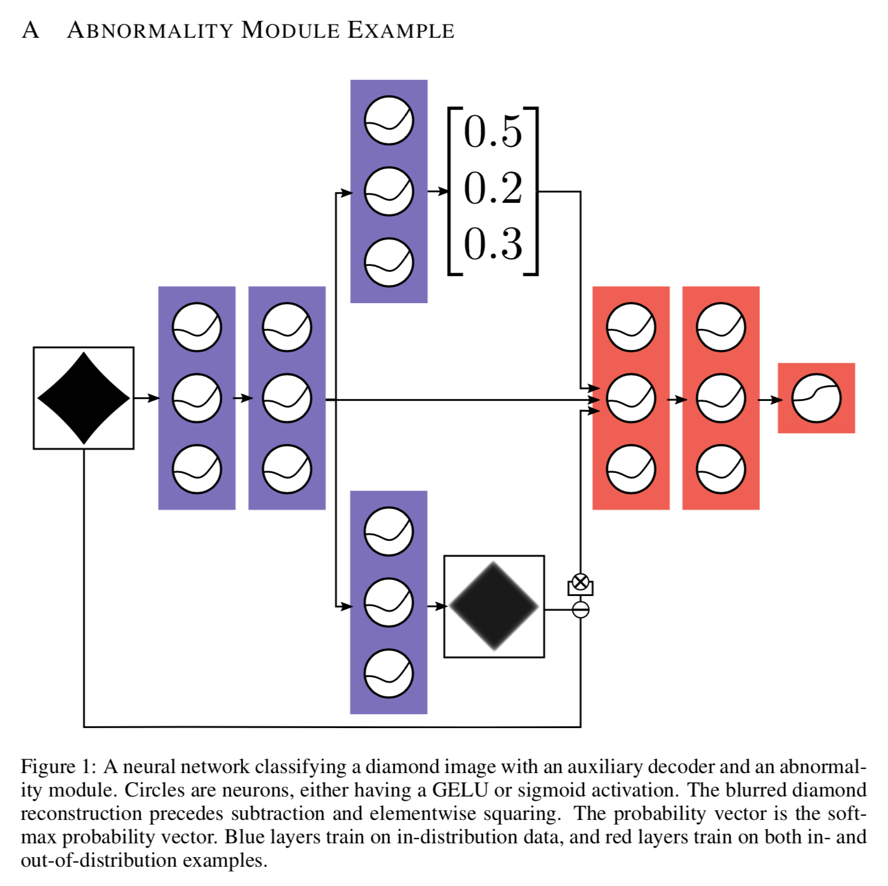

### Usage
```bash
pip3 install -r requirements.txt # OR conda install -r requirements.txt

python3 mnist_softmax.py # Pure softmax detector
```

## Overview

This repository contains reproduced vision experiments in paper  
[_'A Baseline for Detecting Misclassified and Out-of-Distribution Examples in Neural Networks'_](https://arxiv.org/abs/1610.02136),  
(by Hendrycks et al.), which discusses about the OOD topic intensely.  
It uses **Tensorflow Keras API** to build model blocks.

To see references(Papers, original code), please check below resources.  
Any suggestions or corrections are welcome.  
  
  

### Abnormality module for anomaly detection

  

The paper suggests utilizing Anomality module to enhance overall performance.

### Version range, Dependencies


### Resources:

-   [https://arxiv.org/abs/1610.02136](https://arxiv.org/abs/1610.02136)
-   [https://github.com/hendrycks/error-detection](https://github.com/hendrycks/error-detection) (Original repository)

## Citation

    @inproceedings{hendrycks17baseline,
      author    = {Dan Hendrycks and Kevin Gimpel},
      title     = {A Baseline for Detecting Misclassified and Out-of-Distribution Examples in Neural Networks},
      booktitle = {Proceedings of International Conference on Learning Representations},
      year = {2017},
    }
